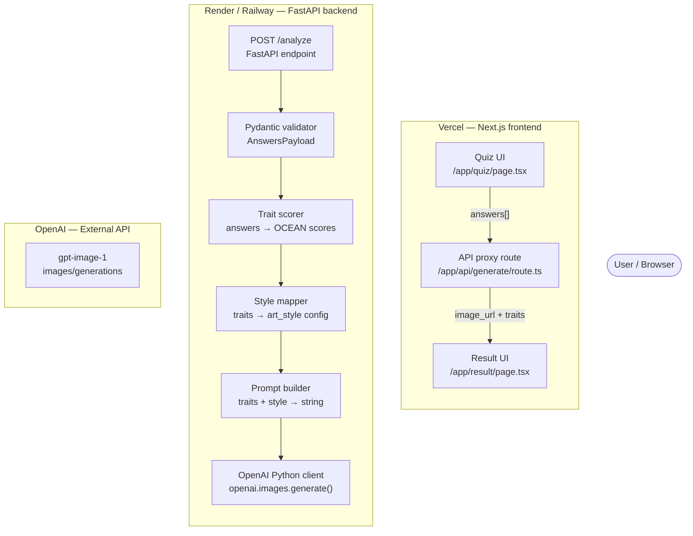

  User -->|"HTTP"| QuizUI
  APIRoute -->|"POST /analyze"| Endpoint
  OpenAIClient -->|"images API"| ImageGen
  ImageGen -->|"base64 PNG"| OpenAIClient
  Endpoint -->|"200 OK · image_url + traits"| APIRoute
  ResultUI -->|"renders image"| User
