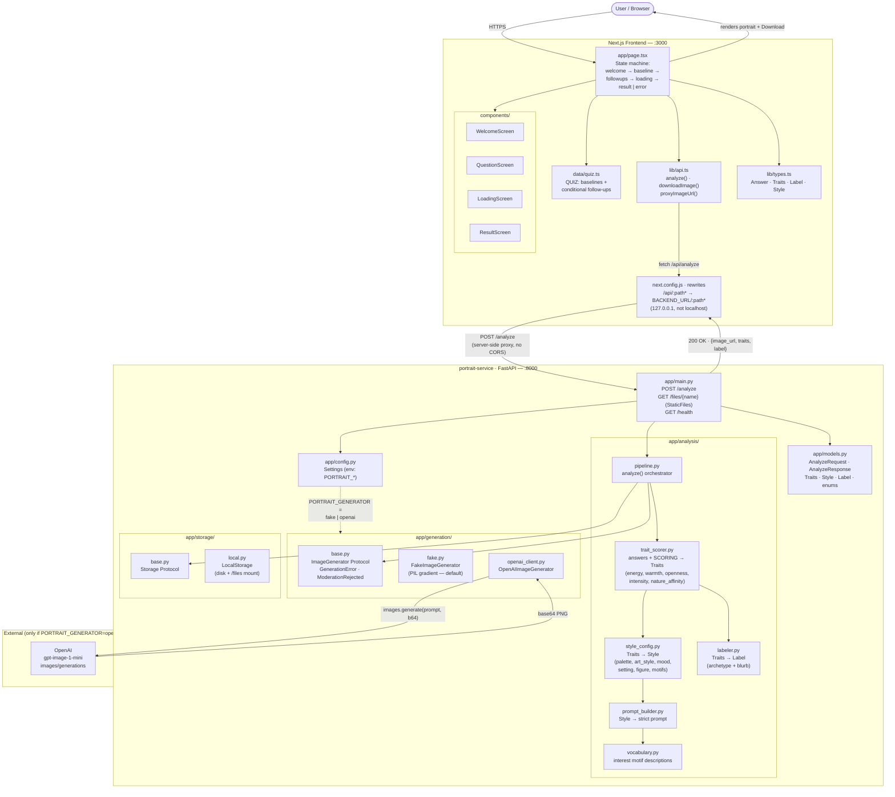

```mermaid
flowchart TD
    User(["User / Browser"])

    subgraph FE ["Next.js Frontend — :3000"]
        direction TB
        Page["app/page.tsx<br/>State machine:<br/>welcome → baseline →<br/>followups → loading →<br/>result | error"]
        Data["data/quiz.ts<br/>QUIZ: baselines +<br/>conditional follow-ups"]
        Api["lib/api.ts<br/>analyze() · downloadImage()<br/>proxyImageUrl()"]
        Types["lib/types.ts<br/>Answer · Traits · Label · Style"]

        subgraph Comps ["components/"]
            direction LR
            W["WelcomeScreen"]
            Q["QuestionScreen"]
            L["LoadingScreen"]
            R["ResultScreen"]
        end

        Rewrite["next.config.js · rewrites<br/>/api/:path* → BACKEND_URL/:path*<br/>(127.0.0.1, not localhost)"]

        Page --> Comps
        Page --> Data
        Page --> Api
        Page --> Types
        Api -->|"fetch /api/analyze"| Rewrite
    end

    subgraph BE ["portrait-service · FastAPI — :8000"]
        direction TB
        Main["app/main.py<br/>POST /analyze<br/>GET /files/{name} (StaticFiles)<br/>GET /health"]
        Cfg["app/config.py<br/>Settings (env: PORTRAIT_*)"]
        Mdl["app/models.py<br/>AnalyzeRequest · AnalyzeResponse<br/>Traits · Style · Label · enums"]

        subgraph An ["app/analysis/"]
            direction TB
            Pipe["pipeline.py<br/>analyze() orchestrator"]
            TS["trait_scorer.py<br/>answers + SCORING → Traits<br/>(energy, warmth, openness,<br/>intensity, nature_affinity)"]
            SC["style_config.py<br/>Traits → Style<br/>(palette, art_style, mood,<br/>setting, figure, motifs)"]
            LB["labeler.py<br/>Traits → Label<br/>(archetype + blurb)"]
            PB["prompt_builder.py<br/>Style → strict prompt"]
            Voc["vocabulary.py<br/>interest motif descriptions"]
        end

        subgraph Gen ["app/generation/"]
            direction TB
            GB["base.py<br/>ImageGenerator Protocol<br/>GenerationError · ModerationRejected"]
            FG["fake.py<br/>FakeImageGenerator<br/>(PIL gradient — default)"]
            OG["openai_client.py<br/>OpenAIImageGenerator"]
        end

        subgraph St ["app/storage/"]
            direction TB
            SB["base.py<br/>Storage Protocol"]
            LS["local.py<br/>LocalStorage<br/>(disk + /files mount)"]
        end

        Main --> Mdl
        Main --> Cfg
        Main --> Pipe
        Pipe --> TS
        TS --> SC
        TS --> LB
        SC --> PB
        PB --> Voc
        Pipe --> GB
        Pipe --> SB
        Cfg -.->|"PORTRAIT_GENERATOR =<br/>fake | openai"| Gen
    end

    subgraph Ext ["External (only if PORTRAIT_GENERATOR=openai)"]
        OpenAIAPI["OpenAI<br/>gpt-image-1-mini<br/>images/generations"]
    end

    User -->|"HTTPS"| Page
    Rewrite -->|"POST /analyze<br/>(server-side proxy, no CORS)"| Main
    OG -->|"images.generate(prompt, b64)"| OpenAIAPI
    OpenAIAPI -->|"base64 PNG"| OG
    Main -->|"200 OK · {image_url, traits, label}"| Rewrite
    Page -->|"renders portrait + Download"| User
```
