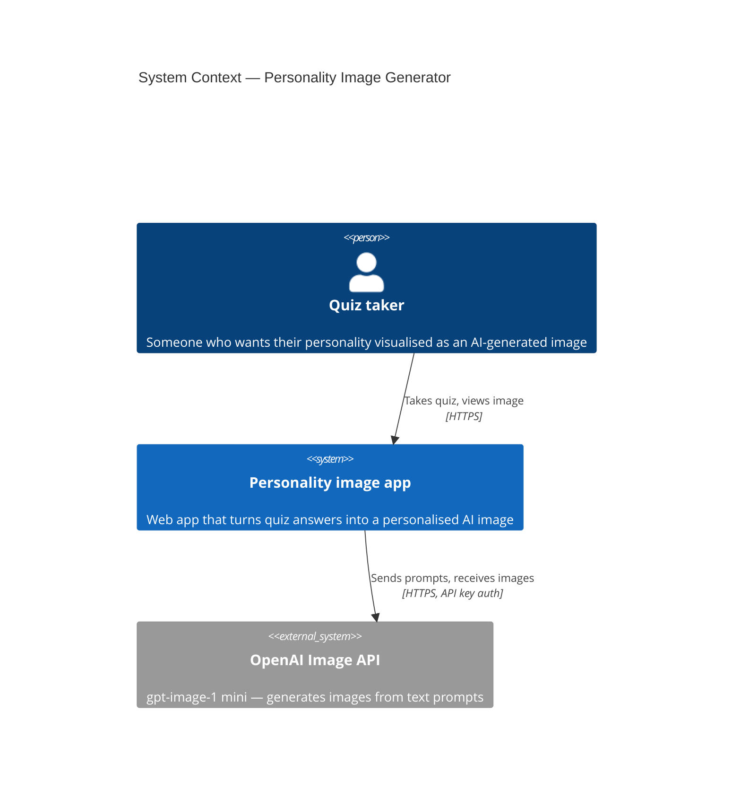
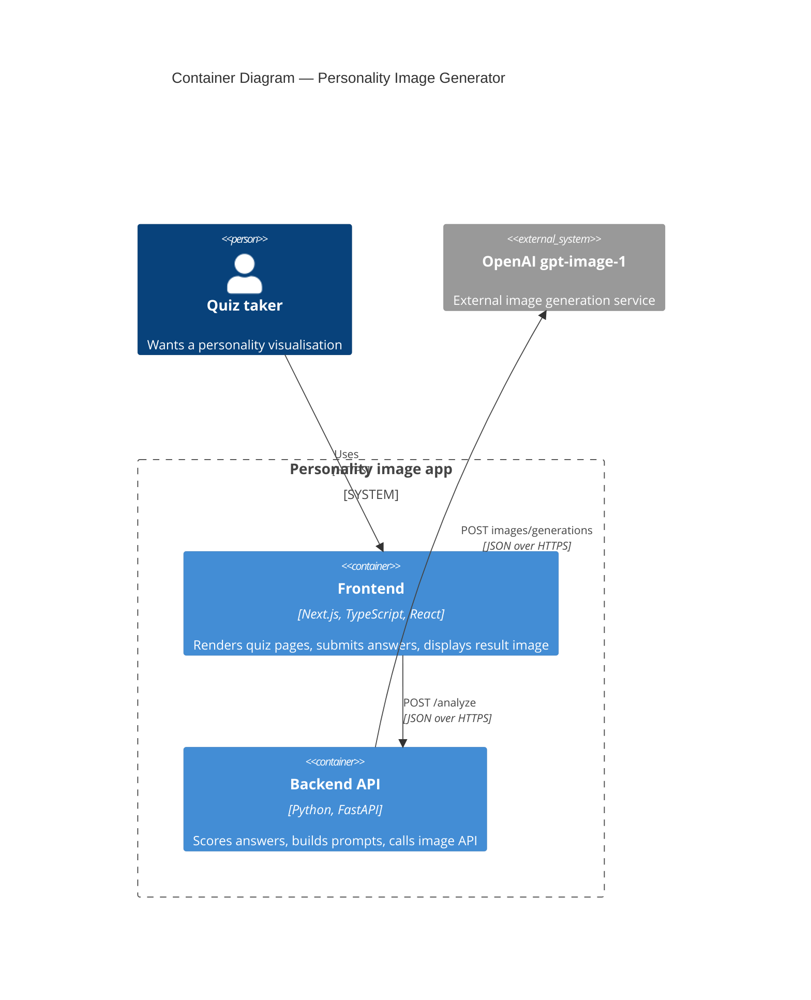
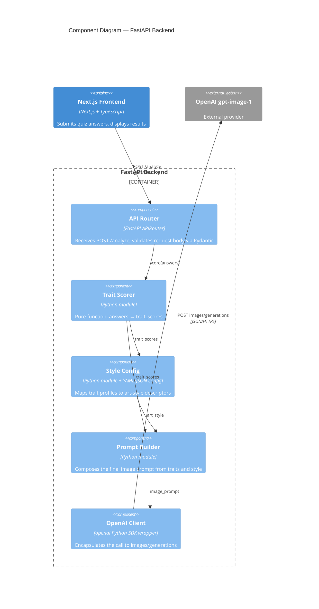

### Context

```mermaid
C4Context
    title System Context — Personality Image Generator

    Person(user, "Quiz taker", "Someone who wants their personality visualised as an AI-generated image")

    System(app, "Personality image app", "Web app that turns quiz answers into a personalised AI image")

    System_Ext(openai, "OpenAI Image API", "gpt-image-1 mini — generates images from text prompts")

    Rel(user, app, "Takes quiz, views image", "HTTPS")
    Rel(app, openai, "Sends prompts, receives images", "HTTPS, API key auth")
```

### Container

```mermaid
C4Container
    title Container Diagram — Personality Image Generator

    Person(user, "Quiz taker", "Wants a personality visualisation")

    System_Boundary(app, "Personality image app") {
        Container(frontend, "Frontend", "Next.js, TypeScript, React", "Renders quiz pages, submits answers, displays result image")
        Container(backend, "Backend API", "Python, FastAPI", "Scores answers, builds prompts, calls image API")
    }

    System_Ext(openai, "OpenAI gpt-image-1", "External image generation service")

    Rel(user, frontend, "Uses", "HTTPS")
    Rel(frontend, backend, "POST /analyze", "JSON over HTTPS")
    Rel(backend, openai, "POST images/generations", "JSON over HTTPS")
```

### Component

```mermaid
C4Component
    title Component Diagram — FastAPI Backend

    Container(frontend, "Next.js Frontend", "Next.js + TypeScript", "Submits quiz answers, displays results")

    Container_Boundary(backend, "FastAPI Backend") {
        Component(router, "API Router", "FastAPI APIRouter", "Receives POST /analyze, validates request body via Pydantic")
        Component(scorer, "Trait Scorer", "Python module", "Pure function: answers → trait_scores")
        Component(style, "Style Config", "Python module + YAML/JSON config", "Maps trait profiles to art-style descriptors")
        Component(prompt, "Prompt Builder", "Python module", "Composes the final image prompt from traits and style")
        Component(client, "OpenAI Client", "openai Python SDK wrapper", "Encapsulates the call to images/generations")
    }

    System_Ext(openai, "OpenAI gpt-image-1", "External provider")

    Rel(frontend, router, "POST /analyze", "JSON/HTTPS")
    Rel(router, scorer, "score(answers)")
    Rel(scorer, prompt, "trait_scores")
    Rel(scorer, style, "trait_scores")
    Rel(style, prompt, "art_style")
    Rel(prompt, client, "image_prompt")
    Rel(client, openai, "POST images/generations", "JSON/HTTPS")
```
