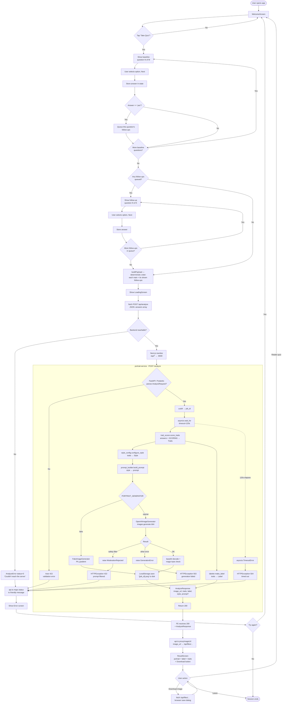

```mermaid
flowchart TD
    Start([User opens app]) --> Welcome[WelcomeScreen]
    Welcome --> TapStart{"Tap 'Take Quiz'?"}
    TapStart -->|No| Welcome
    TapStart -->|Yes| Baseline["Show baseline<br/>question N of M"]

    Baseline --> AnswerB["User selects option, Next"]
    AnswerB --> StoreB["Store answer in state"]
    StoreB --> CheckYes{"Answer == 'yes'?"}
    CheckYes -->|Yes| QueueF["Queue this question's<br/>follow-ups"]
    CheckYes -->|No| MoreBaseline{"More baseline<br/>questions?"}
    QueueF --> MoreBaseline
    MoreBaseline -->|Yes| Baseline
    MoreBaseline -->|No| AnyFollowups{"Any follow-ups<br/>queued?"}

    AnyFollowups -->|Yes| FollowUp["Show follow-up<br/>question N of K"]
    FollowUp --> AnswerF["User selects option, Next"]
    AnswerF --> StoreF["Store answer"]
    StoreF --> MoreFollow{"More follow-ups<br/>in queue?"}
    MoreFollow -->|Yes| FollowUp
    MoreFollow -->|No| BuildPayload
    AnyFollowups -->|No| BuildPayload

    BuildPayload["buildPayload — deterministic order:<br/>each main + its shown follow-ups"]
    BuildPayload --> ShowLoading["Show LoadingScreen"]
    ShowLoading --> POST["fetch POST /api/analyze<br/>JSON: answers array"]
    POST --> NetCheck{"Backend reachable?"}
    NetCheck -->|No| NetErr["AnalyzeError status=0<br/>'Couldn't reach the server'"]
    NetCheck -->|Yes| NextProxy["Next.js rewrites<br/>/api/* → :8000"]

    NextProxy --> Backend

    subgraph Backend ["portrait-service · POST /analyze"]
        direction TB
        Validate{"FastAPI / Pydantic<br/>parses AnalyzeRequest?"}
        Validate -->|No| Err422V["Auto 422<br/>validation error"]
        Validate -->|Yes| JobId["uuid4 → job_id"]
        JobId --> WaitFor["asyncio.wait_for<br/>timeout=120s"]
        WaitFor --> Score["trait_scorer.score_traits<br/>answers + SCORING → Traits"]
        Score --> Style["style_config.configure_style<br/>traits → Style"]
        Score --> Label["labeler.make_label<br/>traits → Label"]
        Style --> Build["prompt_builder.build_prompt<br/>style → prompt"]
        Build --> Branch{"PORTRAIT_GENERATOR"}
        Branch -->|fake| Fake["FakeImageGenerator<br/>PIL gradient"]
        Branch -->|openai| OpenAI["OpenAIImageGenerator<br/>images.generate b64"]
        OpenAI --> AIResult{"Result"}
        AIResult -->|safety filter| RaiseMod["raise ModerationRejected"]
        AIResult -->|other error| RaiseGen["raise GenerationError"]
        AIResult -->|OK| DecodeB64["base64 decode +<br/>magic-byte check"]
        Fake --> Save
        DecodeB64 --> Save["LocalStorage.save<br/>'{job_id}.png' to disk"]
        Save --> Pack["AnalyzeResponse<br/>image_url, traits, label,<br/>style, prompt?"]
        Label --> Pack
        Pack --> Return200["Return 200"]
        WaitFor -.->|"120s elapses"| RaiseTimeout["asyncio.TimeoutError"]
        RaiseMod --> Err422M["HTTPException 422<br/>prompt filtered"]
        RaiseTimeout --> Err504["HTTPException 504<br/>timed out"]
        RaiseGen --> Err502["HTTPException 502<br/>generation failed"]
    end

    Return200 --> Receive["FE receives 200<br/>+ AnalyzeResponse"]
    Receive --> Rewrite["api.ts proxyImageUrl<br/>image_url → /api/files/..."]
    Rewrite --> RenderResult["ResultScreen<br/>portrait + label + traits<br/>+ Download button"]

    Err422V --> MapErr
    Err422M --> MapErr
    Err502 --> MapErr
    Err504 --> MapErr
    NetErr --> MapErr["api.ts maps status<br/>to friendly message"]
    MapErr --> ShowErr["Show Error screen"]

    RenderResult --> UserChoice{"User action"}
    UserChoice -->|"Download image"| Download["fetch /api/files/...<br/>browser save dialog"]
    UserChoice -->|"Retake quiz"| Welcome
    UserChoice -->|"Leave"| End(["Session ends"])
    Download --> UserChoice

    ShowErr --> Retry{"Try again?"}
    Retry -->|Yes| Welcome
    Retry -->|No| End
```
