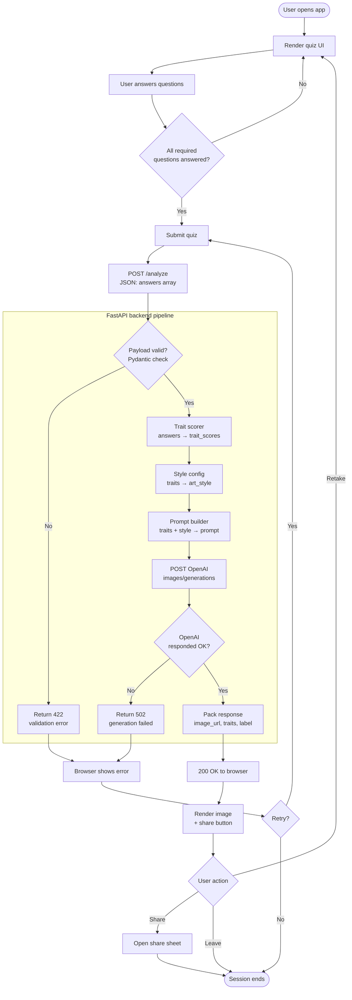

```mermaid
flowchart TD
    Start([User opens app]) --> Quiz[Render quiz UI]
    Quiz --> Answer[User answers questions]
    Answer --> Complete{All required<br/>questions answered?}
    Complete -->|No| Quiz
    Complete -->|Yes| Submit[Submit quiz]

    Submit --> POST[POST /analyze<br/>JSON: answers array]

    subgraph Backend [FastAPI backend pipeline]
        direction TB
        Validate{Payload valid?<br/>Pydantic check}
        Validate -->|No| Err422[Return 422<br/>validation error]
        Validate -->|Yes| Score[Trait scorer<br/>answers → trait_scores]
        Score --> Style[Style config<br/>traits → art_style]
        Style --> Build[Prompt builder<br/>traits + style → prompt]
        Build --> CallAI[POST OpenAI<br/>images/generations]
        CallAI --> AIOK{OpenAI<br/>responded OK?}
        AIOK -->|No| Err502[Return 502<br/>generation failed]
        AIOK -->|Yes| Pack[Pack response<br/>image_url, traits, label]
    end

    POST --> Validate
    Pack --> Return200[200 OK to browser]
    Err422 --> ShowErr[Browser shows error]
    Err502 --> ShowErr

    Return200 --> Render[Render image<br/>+ share button]

    Render --> UserChoice{User action}
    UserChoice -->|Share| Share[Open share sheet]
    UserChoice -->|Retake| Quiz
    UserChoice -->|Leave| End([Session ends])

    ShowErr --> RetryQ{Retry?}
    RetryQ -->|Yes| Submit
    RetryQ -->|No| End
    Share --> End
```
