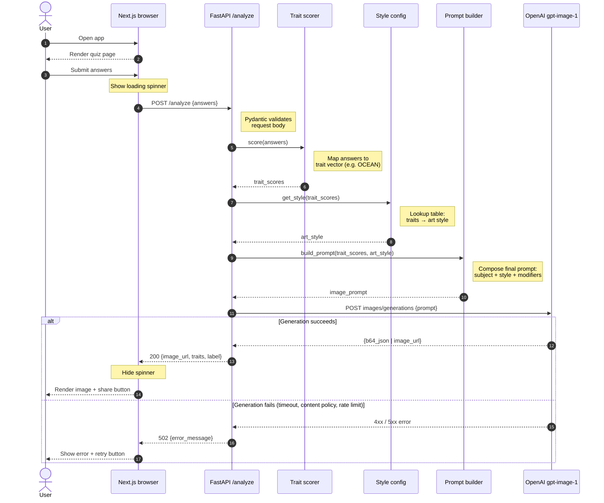

```mermaid
sequenceDiagram
    autonumber
    actor User
    participant B as Next.js browser
    participant API as FastAPI /analyze
    participant TS as Trait scorer
    participant SC as Style config
    participant PB as Prompt builder
    participant AI as OpenAI gpt-image-1

    User->>B: Open app
    B-->>User: Render quiz page
    User->>B: Submit answers
    Note over B: Show loading spinner

    B->>API: POST /analyze {answers}
    Note right of API: Pydantic validates<br/>request body

    API->>TS: score(answers)
    Note right of TS: Map answers to<br/>trait vector (e.g. OCEAN)
    TS-->>API: trait_scores

    API->>SC: get_style(trait_scores)
    Note right of SC: Lookup table:<br/>traits → art style
    SC-->>API: art_style

    API->>PB: build_prompt(trait_scores, art_style)
    Note right of PB: Compose final prompt:<br/>subject + style + modifiers
    PB-->>API: image_prompt

    API->>AI: POST images/generations {prompt}

    alt Generation succeeds
        AI-->>API: {b64_json | image_url}
        API-->>B: 200 {image_url, traits, label}
        Note over B: Hide spinner
        B-->>User: Render image + share button
    else Generation fails (timeout, content policy, rate limit)
        AI-->>API: 4xx / 5xx error
        API-->>B: 502 {error_message}
        B-->>User: Show error + retry button
    end
```
