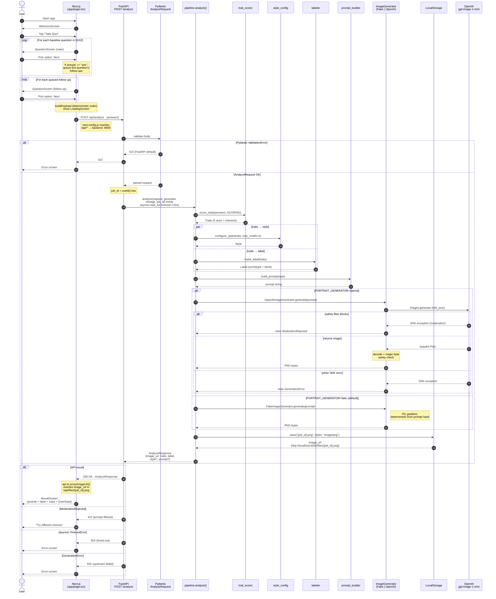

```mermaid
sequenceDiagram
    autonumber

    actor U as User
    participant FE as Next.js<br/>(app/page.tsx)
    participant API as FastAPI<br/>POST /analyze
    participant PV as Pydantic<br/>AnalyzeRequest
    participant PP as pipeline.analyze()
    participant TS as trait_scorer
    participant SC as style_config
    participant LB as labeler
    participant PB as prompt_builder
    participant GEN as ImageGenerator<br/>(Fake | OpenAI)
    participant ST as LocalStorage
    participant AI as OpenAI<br/>gpt-image-1-mini

    U->>FE: Open app
    FE-->>U: WelcomeScreen
    U->>FE: Tap "Take Quiz"

    loop For each baseline question in QUIZ
        FE-->>U: QuestionScreen (main)
        U->>FE: Pick option, Next
        Note over FE: If answer == "yes",<br/>queue this question's<br/>follow-ups
    end

    loop For each queued follow-up
        FE-->>U: QuestionScreen (follow-up)
        U->>FE: Pick option, Next
    end

    Note over FE: buildPayload (deterministic order)<br/>show LoadingScreen

    FE->>API: POST /api/analyze · {answers}
    Note right of FE: next.config.js rewrites<br/>/api/* → backend :8000

    API->>PV: validate body

    alt Pydantic ValidationError
        PV-->>API: 422 (FastAPI default)
        API-->>FE: 422
        FE-->>U: Error screen
    else AnalyzeRequest OK
        PV-->>API: parsed request
        Note over API: job_id = uuid4().hex
        API->>PP: analyze(request, generator,<br/>storage, job_id) inside<br/>asyncio.wait_for(timeout=120s)

        PP->>TS: score_traits(answers, SCORING)
        TS-->>PP: Traits (5 axes + interests)

        par traits → style
            PP->>SC: configure_style(traits, max_motifs=4)
            SC-->>PP: Style
        and traits → label
            PP->>LB: make_label(traits)
            LB-->>PP: Label (archetype + blurb)
        end

        PP->>PB: build_prompt(style)
        PB-->>PP: prompt string

        alt PORTRAIT_GENERATOR=openai
            PP->>GEN: OpenAIImageGenerator.generate(prompt)
            GEN->>AI: images.generate (b64_json)
            alt safety filter blocks
                AI-->>GEN: SDK exception (moderation)
                GEN-->>PP: raise ModerationRejected
            else returns image
                AI-->>GEN: base64 PNG
                Note over GEN: decode + magic-byte<br/>sanity check
                GEN-->>PP: PNG bytes
            else other SDK error
                AI-->>GEN: SDK exception
                GEN-->>PP: raise GenerationError
            end
        else PORTRAIT_GENERATOR=fake (default)
            PP->>GEN: FakeImageGenerator.generate(prompt)
            Note right of GEN: PIL gradient,<br/>deterministic from prompt hash
            GEN-->>PP: PNG bytes
        end

        PP->>ST: save("{job_id}.png", bytes, "image/png")
        ST-->>PP: image_url<br/>(http://localhost:8000/files/{job_id}.png)

        PP-->>API: AnalyzeResponse<br/>{image_url, traits, label,<br/>style?, prompt?}
    end

    alt API result
        API-->>FE: 200 OK · AnalyzeResponse
        Note over FE: api.ts proxyImageUrl()<br/>rewrites image_url to<br/>/api/files/{job_id}.png
        FE-->>U: ResultScreen<br/>(portrait + label + traits + Download)
    else ModerationRejected
        API-->>FE: 422 (prompt filtered)
        FE-->>U: "Try different choices"
    else asyncio.TimeoutError
        API-->>FE: 504 (timed out)
        FE-->>U: Error screen
    else GenerationError
        API-->>FE: 502 (upstream failed)
        FE-->>U: Error screen
    end
```
